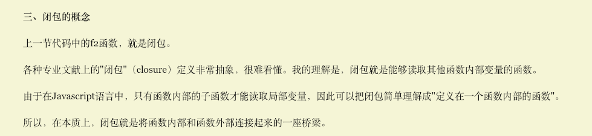

##### 三个角色：作用域、编译器、引擎 
变量的赋值操作会执行两个动作，首先`编译器`会在`当前作用域`中声明一个变量（如果之前没有声明过），然后再`运行时引擎`会在`作用域`中查找该变量，如果能够找到就会对他赋值

```
比如：var a =2这样的声明会被分解成两个独立的步骤：
首先，var a在其作用域中声明新变量，这会在代码执行前进行。
接下来，a = 2引擎会查询（LHS查询）变量a并对他进行赋值
```
>注：作用域是一套规则，用于确定引擎在何处以及如何查找变量。如果查找的目的是对变量进行赋值，那么就会使用LHS查询。`LHS`比较松散，如果查询不到就会创建一个全局的，不会抛出异常。如果目的是获取变量的值，那么就会使用`RHS`查询。如果沿着`作用域链`到达顶层也没有找到变量，则不成功的RHS引用会抛出异常ReferenceError,而不成功的LHS引用会导致自动隐式地创建一个全局变量（非严格模式下）。严格模式下会抛出异常ReferenceError。(缺少var声明，变成全局变量就是这个原因)

> **小贴士：** 如果一个函数只会在某个函数内部被调用，外部不需要知道的时候，最好把这个函数定义在该函数内部，这样就避免了外部访问。这种设计是从最小特权原则中引申出来的，这个原则是指在软件设计中，应该最小限度地暴露必要内容，而将其他内容都“隐藏”起来，比如某个模块或对象的API设计。而且这样做还能避免很多命名冲突。
---
##### 函数表达式、函数声明
>函数表达式和函数声明最重要的区别在于他们的名称标识符将会绑定在不同的位置。
>--函数声明会被绑定到所在作用域中，可以直接通过foo()调用（例一）。
>--而函数表达式被绑定在函数表达式自身的函数中而不是所在的作用域中。（例二、三、四、五）意思就是（function foo(){...}）作为函数表达式意味着foo只能在...所代表的位置中被访问，外部作用域则不行。foo变量名被隐藏在自身中意味着不会非必要的污染外部作用域。
>--区分函数表达式和函数声明的方法就是看function关键字是否出现在**整个声明**的第一个词

例一：这个是函数`声明`
```js
function foo(){
    console.log('aa');
}
foo()//可以直接通过foo（）调用
```
例二：这是一个函数`表达式`
```js
var a = function b(){console.log('b')}
b() // Uncaught ReferenceError: b is not defined
a() //'b'
```
例三：这是一个匿名函数`表达式`。
```js
setTimeout(function(){
    console.log('i want 1 second !')
},1000)
```
例四：这是一个具名函数`表达式`
```js
//timer被绑定在函数表达式自身的函数作用域中，在外部是访问不到的。
setTimeout(function timer(){
    console.log('i want 1 second !')
},1000)
```
例五：这也是函数`表达式`
```js
//foo被绑定在函数表达式自身的函数中而不是所在作用域中，在外部是访问不到的,所以这种方式不会污染作用域。
var a = 2;
(function foo(){
    var a = 3;
    console.log(a);//3
})();
console.log(a);//2
foo()//ReferenceError: foo is not defined
```
函数表达式可以是匿名的，而函数声明则不可以省略函数名。
**函数声明是会被提升的，而函数表达式并不会被提升。**

---
##### 函数作用域、块作用域
>`执行环境`定义了变量或者函数有权访问的其他数据。每个执行环境都有一个与之关联的`变量对象`，`环境中定义的所有变量和函数都是保存在这个对象中的`。虽然我们编写的代码是无法访问到这个对象，但是解析器在处理数据时会在后台使用它。
>当代码在一个环境中`执行`时，会创建变量对象的一个作用域链。作用域链保证了对执行环境有权访问的素有变量和函数的有序访问。作用域链的前端，始终都是当前置换的代码所在华宁的变量对象。**`作用域链其实就是变量对象的串联。而这个变量对象中保存了该环境中定义的所有变量和函数`**

在js中有两种作用域，一个是函数创建的作用域，还有一个就是块作用域。

1. 函数作用域，每个`函数`都有自己的`执行环境`，当某个函数被调用时，都会创建一个执行环境及相应的作用域链，每个执行环境都有一个表示变量的对象——变量对象。当执行流进入一个函数时，函数的环境就会被推入一个`环境栈`中。而在函数执行之后，栈将其环境弹出，把控制权返回给之前的执行环境。ECMAScript程序中的执行流正是由这个方便的机制控制着。函数内的变量只能在函数内部访问，在函数外部访问不到。作用域链本质上是一个指向变量对象的指针列表。
2. 块作用域，表面上看es5之前还是没有块作用域的概念的（with,try-catch还是有块作用域的概念的），直到es6中引入了let之类的相关概念，才有了块作用域。let会劫持块成为一个块级作用域！！
```js
//var 的例子

//b定义在if里面，但是外部仍然还是可以访问得到。
if(1){
    var b=1;
}
b//1

// 这里的i虽然定义在for里面，但是i却会被绑定在外部作用域（函数或全局）中。
for(var i=0;i<3;i++){...}

```
```js
//let 的例子

//let关键字可以将变量绑定到所在的任意作用域中（通常是{...}内部）
if(1){
    let b= 1;
}
console.log(b)//ReferenceError: b is not defined

//let关键字不仅会把i绑定到for的循环块中，还会将其重新绑定到循环的每一个迭代中，确保使用上一个循环迭代结束时的值进行重新赋值。
for(let i=0;i<3;i++){...}
```
---
##### 提升
每个作用域都存在提升，把变量或者函数的声明提升到该作用域的顶部。类不存在变量提升。
```js
//函数声明， 会被提升
function Foo(){...}

//函数表达式，不会被提升（即使是具名的函数表达式也不会被提升）
var foo = function bar(){...}
```
函数的声明优先于变量的声明，及相同的函数声明会提升到比变量声明更高的位置，由于函数先声明了同名变量，变量再声明这个变量的时候，编译器会忽略。但出现在后面的函数声明还是可以覆盖前面的。

---
##### 闭包
这个例子就清晰的展示了闭包。
```js
function foo(){
    var a =2;
    function bar(){
        console.log(a);
    }
    return bar;
}
var baz = foo();
baz();//2 实际上就是调用bar
```
**这里比较特殊的地方就是bar在自己定义的词法作用域以外的外置被执行。但是由于bar声明的位置是在foo内部，所以bar拥有foo内部作用域的引用（闭包）,即便bar是在词法作用域以外被调用，他对foo内部作用域内部的引用也不会消失（不会被引擎的回收机制回收）。**
其实这种引用就叫做闭包。闭包使得函数可以继续访问定义时的词法作用域。
所以无论是使用何种方式对函数类型的值进行传递，当函数在别处被调用时都可以观察都闭包。
```js
function foo(){
    var a = 2;
    function baz(){
        console.log(a);
    }
    bar(baz); 
}
function bar(fn){
    fn();//这里其实就是调用baz ，baz对foo内部作用域的闭包
}
```

```js
//将内部函数baz传递给bar，他覆盖的foo内部作用域的闭包可以观察到
var fn;
function foo(){
    var a = 2;
    function baz(){
        console.log(a);
    }
    fn = baz;//将baz分配给全局变量
}
function bar(){
    fn()
}
foo()
bar()//2
```
  
>**！！！重要重要：因此无论通过何种手段将内部函数传递到所在的词法作用域以外，他都会持有对原始定义作用域的引用，无论在何处执行这个函数都会使用闭包。**
>原本foo带着自己的家当完完整整地被调用就完事了，但是内部突然出现了一个baz要单独被调用，foo看看都是自己人，当然要支持他啦，就把自己的家当借给baz，这样baz被调用的时候才倍儿有面。

例子：
```js
function wait(message){
    setTimeout(function timer(){
        console.log(message)
    },1000)
}
wait('hello');
```
setTimout都是在全局作用域中执行的。意思就是timer是执行在全局作用域中的，timer的this在非严格模式下指向window。而setTimeout的this就看具体情况咯。timer定义在wait内部，所以拥有覆盖wait作用域的闭包，因此保持着对message的引用。另外这个例子还有一个地方值得注意，timer是函数表达式，它会被绑定在自身内部的作用域上，而不是wait所在的作用域中（在wait里直接访问timer是访问不到的）。

>本质上，如果将函数当做第一级的值类型并到处传递，就会看到闭包在这些函数中的应用。比如定时器，事件监听，Ajax请求，跨窗口通信，web Workers或者任何其他的异步（同步）任务，只要使用了回调函数，实际上就是在使用闭包。因为他们都不是在定义他们的作用域中杯执行。
---
##### 循环和闭包

```js
for(var i=1;i<=5;i++){
    setTimtout(function timer(){
        console.log(i);
    },i*1000)
}//6,6,6,6,6
```
因为setTimeout的回调都是在for循环结束之后才调用的，i都已经变成6了。所以会输出5个6.虽然这5和函数是在各自的迭代中被分别定义的，但是他们都被封闭在一个共享的全局作用域中，因此实际上只有一个i。

如果要输出’正确‘的结果，思路是为每个timer创建一个独立的作用域。我们进行改进。
>**立即执行函数**：
>立即执行函数通常有两种常见的形式`(function(){})()`、`(function(){}())`。立即执行函数相当于创建了一个单独的作用域。要想立即执行函数能做到立即执行，要注意两点，`一是函数体后面要有小括号()，二是函数体必须是函数表达式而不能是函数声明。`除了使用()运算符之外，！，+，-，=等运算符都能起到立即执行的作用。这些运算符的作用就是将匿名函数或函数声明转换为函数表达式。
>通过定义一个匿名函数，`创建了一个新的函数作用域`，相当于创建了一个“私有”的命名空间，该命名空间的变量和方法，不会破坏污染全局的命名空间。此时若是想访问全局对象，将全局对象以参数形式传进去即可
```js
for(var i=1;i<=5;i++){
    (function(){
        setTimeout(function timer(){
            console.log(i)
        },i*1000)
    })()
}
```
但是上述代码还是没有用，因为虽然每个timer已经有了自己单独的作用域，但是作用域里面仍然是空的，还是引用外部的i。我们需要把i传递进他们各自的作用域中。最终得到
```js
for(var i=1;i<=5;i++){
    (function(j){
        setTimeout(function timer(){
            console.log(j)
        },j*1000)
    })(i)
}
```
如果使用let，let会劫持一个块转换为一个可以被关闭的作用域！！
```js
for(var i=1;i<=5;i++){
    let j=i;//将这个{}包围的块各自形成了一个块作用域！！
    setTimeout(function timer(){
        console.log(i);
    },i*1000)
}
```
另外如果使用let，for(let i=1;i<=5;i++),let会把i绑定到for的循环块中，还会将其重新绑定到循环的每一个迭代中，确保使用上一个循环迭代结束时的值进行重新赋值。
```js
for(let i=1;i<=5;i++){
    setTimeout(function timer(){
        console.log(i);
    },i*1000)
}
```


>模块文件（es6中的模块文件）中的内容会被当做好像包含在作用域闭包中一样来处理。
---
### 当函数可以记住并访问所在的词法作用域，即使函数是在当前词法作用域之外执行，这时就产生了闭包

>我自己的理解：原本foo带着自己的家当完完整整地被调用就完事了，但是内部突然出现了一个baz要单独被调用，foo看看都是自己人，当然要支持他啦，就把自己的家当借给baz，这样baz被调用的时候才倍儿有面。


**关于闭包的用法可以看《JavaScript设计模式与开发实践的第三章》**