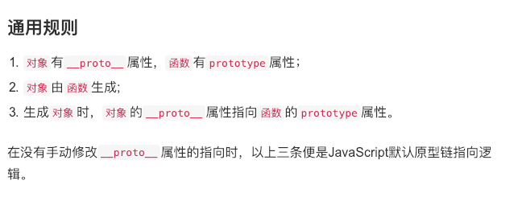

---
#### JS类型
JS在设计中引入了两套类型机制，基本数据类型（简单类型）和引用类型（对象类型,复杂数据类型）。

**基本数据类型：Undefined,Null,Boolean,Number,String,Symbol 6种
引用类型：Object1种**

>基本数据类型是指 非对象 并且无方法的数据。在基本数据类型中除了null和undefined都有包裹这个基本数据类型的等价对象。String,Number,Boolean,Symbol。这个对象的ValueOf()方法返回基本类型值。
>此外，JS内置了很多对象。比如Array,Date.RegExg,Function
```js
//他们都是继承自Object对象的
String.prototype.__proto__ === Object.prototype //true
Array.prototype.__proto__ === Array.prototype //true
```
>基本数据类型是放在`栈`中可以直接访问的，而引用类型是放在`堆`中的。JS规定不能直接访问，而在栈中存放了指针，指向堆中的位置，然后通过访问栈中指针来访问堆。

>JS中的`参数传递`，如果是`传递基本数据类型`的话，会把这个基本数据类型复制给局部作用域中的一个变量，这个变量的改变并不会影响原来的值，但是如果`传递的是引用类型`的话，因为参数传递是引用地址，所以直接指向实际对象，所以内部的改变会直接影响原对象。

---
#### 对象的属性


>[[Enumberable]]可枚举，是指是否可遍历。
```js
//判断myObject中是否有b属性。 
"b" in myObject //in操作符
for(var i in myObject){...}//for in遍历myObject中可枚举的键。
```
>注：`for in` 遍历的是键，所以如果用`for in`遍历数组的话，遍历出来的是数组的下标。而且for in在遍历数组的时候会有一些奇怪的结果，所以最好用传统的for循环，或者for of（ES6,遍历值），forEach（遍历值）来遍历数组。
>
>另外，`for of`会向被访问对象请求一个迭代器对象，数组有内置的迭代器`@@iterator`，而普通对象没有，所以for of 遍历普通对象的时候回报错 `obj is not itetable`
---
#### 原型

**一般情况**

 
只要创建了一个新函数，就会根据一组特定的规则为这个函数创建一个prototype属性，这个属性指向函数的原型对象。在默认情况下，所有原型对象都会自动获取一个constructor属性。这个属性是一个指向prototype属性所在函数的指针。
```js
//创建函数 Foo
//Foo（构造函数）会有一个prototype属性指向Foo.prototype(原型对象)，Foo.prototype（原型对象）会有一个属性constructor指向Foo（构造函数）。这个原型对象默认只会有一个constructor属性，其他属性都是从Object.prototype继承而来的。(这个原型对象是通过new Object()创建的)
function Foo()
```
当用这个构造函数创建了一个实例之后，该实例的内部就创建了一个指针`[[prototype]]/__proto__`，指向构造函数的原型对象（Foo.prototype）。
```js
//a.__proto__ === Foo.prototype
var a = new  Foo();
```

>因为[[prototype]]是内置属性，所以我们是访问不到的，但是Chrome和FireFox等内核都给对象加上了可访问的`__proto__`属性。

>**所以这个连接存在于实例与构造函数的原型对象之间，而不是存在于实例和构造函数之间的。**

>其实构造函数也只是普通的函数，只不过再通过new操作符调用的时候，就变成了构造对象的形式调用。


**Object，Function的原型**
1. `Object.prototype`是原型链的尽头，`Object.prototype.__proto__===null` 。
2. Object函数因为是函数，所以也是由Function构造的，所以`Object._proto_ === Function.prototype`
3. Function自身也是函数，所以`Function.__proto__ === Function.prototype`
4. Function.prototype 是对象，是由Object构造的，所以`Function.prototype.__proto__ === Object.prototype`

**https://www.jianshu.com/p/686b61c4a43d** [Object,Function原型的讲解]


---
#### 原型链相关
**typeof判断类型**
typeof 返回的一个表示数据类型的字符串，返回结果包括number,boolean,string,symbol,object,undefined,function.不能判断null，array。null会返回object，array，Date,regexp都会返回object。null是因为字符编码中，判断前三位是否为0，为0就是object。但是null是全0，所以null是被误判的。像array这些都是从object继承而来的。所以是object类型。

---
**instanceof判断类型**
```js
a instanceof Foo
```
instanceof 操作符的左操作符是一个普通的对象，右边是一个函数。instanceof回答在a的整条[[prototype]]链上是否有指向Foo.prototype的对象。但是instanceof也有弊端。比如:
```js
1 instanceof Number//false
```
1是字面量的方式创造的，不是严谨的实例。从严格意义上来讲，只有实例创造出来的结果才是标准的对象数据类型值，也就是标准的Number这个类的一个实例。但是1还是可以使用Number.prototype上提供的方法。

----
**Object.prototype.toString.call()判断类型**
```js
//下面这种方法是比较准确的判断类型的方式。比较常用
Object.prototype.toString.call({})//[object Object]
Object.prototype.toString.call([])//[object Array]
Object.prototype.toString.call(null)//[object Null]
Object.prototype.toString.call(undefined)//[object Undefined]
```


**new 操作到底干了什么事情**


**相当于：**
**1. 创建一个新对象。从Object.prototype上克隆
2. 这个新对象会被执行[[prototype]]链接。指向构造函数的prototype（原型对象）。这个新对象会绑定到函数调用的this。this指向这个对象。 
3. 执行构造函数中的代码（为这个新对象添加属性）
4. 如果函数没有返回其他对象，那么new表达式中的函数调用会自动返回这个新对象。**

---
**function 操作符到底干了什么事情**
function Foo();
这个函数是Function的实例对象。function就是一个语法糖。内部调用了new Function()。所以才有`Foo.__proto__ === Foo.prototype`

---
**作用域链 和 原型链**
作用域是`编译器`在一块一块，一层一层作用域中找对象或者函数比如在内部作用域中要找setTimeout函数，就要到外层作用域中才能找到，原型链（行为委托）是找某个`对象`以及他的原型链上是否有某个对象或者函数，比如要找A.a，因为A本身没有这个属性，就要到他的原型链上找。


