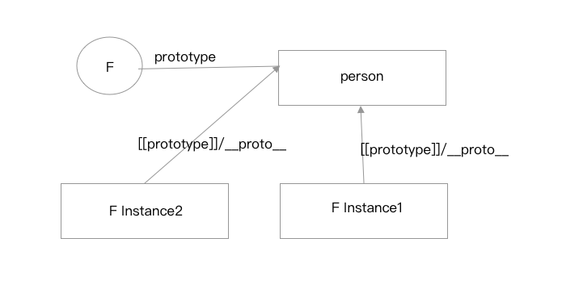
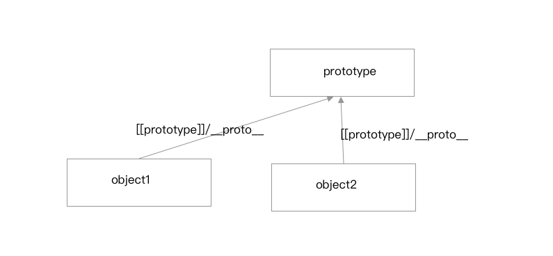
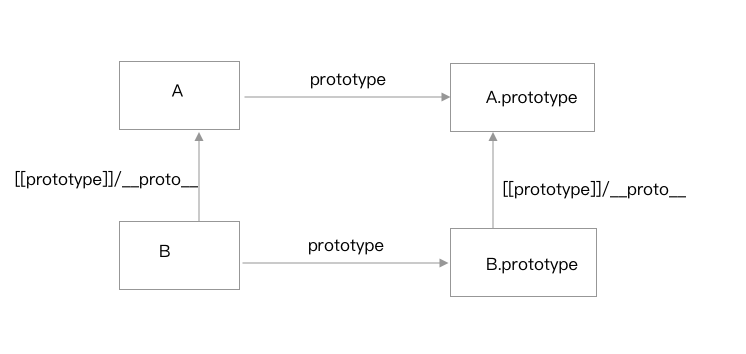

**1. 基本模式**
```js
function SuperType(){this.property = true;}

SuperType.prototype.getSuperValue = function(){
    return this.property; 
}

function SubType(){this.property = false;}

//继承了SuperType，SubType的原型对象是SuperType的一个实例
SubType.prototype = new SuperType();

SubType.prototype.getSubValue = function(){
    return this.superproperty;
}
var instance = nre SubType();
console.log(insatnce.getSuperValue())//true
```
这种方式的集成就是通过创建SuperType的实例，并将这个实例赋给SubType.prototype实现的。实现的本质是重写原型对象，代之以一个新类型的实例。换句话说，原来存在于SuperType的实例中的所有属性和方法，现在也存在与SubType.prototype中。

**优点**：满足了继承的基本需求。
**缺点**：（1）因为原型实际上回变成另一个类型的实例，所以，父类实例属性也就变成了子类的原型属性了。意思就是父类的实例属性成了所有子类实例所共享的了。(2)在创建子类实例的时候，不能向父类的构造函数中传递参数。

**2. 借用构造函数**
```js
function SuperType(){
    this.color = ['red','blue','green'];
}
function SubType(){
    //继承了SuperType
    SuperType.call(this);
}
var instance1 = new SubType();
instance.color.push('grey');
console.log(instance1.color)//['red','blue','green','grey'];

var instance2 = new SubType();
console.log(insatnce.color)//['red','blue','green']
```
我们实际上是在（未来将要）新创建的SubType实例的环境中调用了SuperType构造函数。这样一来，就会在新的SubType对象上执行SuperType()函数中定义的所有对象初始化代码。结果，SubType的每个实例都会有具有自己的color属性的副本了。
这个方式的继承。SubType和SuperType之间并没有原型链上的关联。知识在SubType上借用了SuperType的构造方法而已。所以`instance1 instanceof SuperType//false`
**优点**：父类中的属性都会在各个子类的实例中单独创造一份。
**缺点**：（1）因为父类的属性都会在各个子类的实例中单独创建一份，所以函数也是会各自创建，无法做到方法的共享。但是如果把方法定义在父类的原型对象上，父类和子类之间实际上没有原型链的连接关系，所以父类原型对象上的方法对子类来说也是不可见的（2）无法检测子类是从那个父类继承而来的。

**3.  常用！！组合继承**
```js
function SuperType(name){
    this.name =name;
    this.color = ['red','blue','green'];
}
SuperType.prototype.sayName = fucntion(){
    console.log(this.name);
}
function SubType(name,age){
    //继承属性
    SuperType.call(this,name);//在创建子类的实例的时候，都调用了父类的构造函数，所以每个子类的实例都有单独的一份属性。
    this.age = age;
}
//继承方法
SubType.prototype = new SuperType();//子类的原型是父类的实例，父类的实例属性对于子类来说同样还是全局共享的。但是因为子类也有同名的属性，（因为调用了父类的构造函数）所以会产生屏蔽。
SubType.prototype.constructor = SubType;//矫正子类的construct指针
SubType.prototype.sayAge = function(){//定义子类原型上的方法
    console.log(this.age);
}

var instance1 = new SubType('name1',11);
instance1.color.push('black');
console.log(instance1.color)// ['red','blue','green','black']
instance1.sayName()//'name1'
instance1.sayAge()//11

var instance2 = new SubType('name2',12);
console.log(instance2.color)// ['red','blue','green']
instance2.sayName()//'name2'
instance2.sayAge()//12
```
**优点**：可以共享方法，因为可以通过原型链来查找到。实例的属性也是独立的。还能通过instanceof 来查看子类和父类的继承关系。这个也是最常用的继承的方法。
**缺点**：SubType的实例和SubType.prototype上都会有一份SuperType构造函数中定义的属性。

**4. 常用！！原型式继承**
```js
function object(o){ //在ES5中有方法Object.create()。
    function F(){};//创建临时函数
    F.protitype = o;//将传入的对象作为这个临时函数的原型。
    return new F();//返回这个临时类型的一个新实例
}
var person = {
    name:'name1',
    friends :['S','H']
}
var anotherPerson = object(person);
anotherPerson.name = "name2";
anotherPerson.friends.push('E');

var anotherPerson = object(person);
yetAnotherPerson.name = "name3";
yetAnotherPerson.friends.push('O');

console.log(person.friends)//['S','H','E','O']
```

这种方式的继承要求必须要有一个对象作为另一个对象的基础，将这个对象作为对原型。父类中的方法和属性是子类对象们所共有的。ES5中的Object.create()的实现就是这个例子中的object的实现。创建一个克隆就非常方便了。`var person2 = Object.create(person)`。person2需要自己的特殊的属性，可以单独定义。Object.create()方法创建一个”空“对象，并把新对象内部的[[prototype]]关联到你指定的对象。这种方式也成为”差异化“继承，通过定制一些新的对象，我们指明它所基于的基本对象的差异和区别。
**优点**：这个方法没有多余的构造函数，当没有必要兴师动众的创建构造函数，而只是想让一个对象保持类似的情况下，原型模式继承是完全可以胜任的。
**缺点**：包含引用类型值的属性始终都会共享相应的值。

**5. 继承式继承**
```js
function createAnother(origin){
    var clone = object(original);
    clone.sayHi = function(){console.log('hi')}//这个增强的函数是每个实例都独有的，不是共享的。
    return clone;
}
var person = {
    name:'name1'
}
var anotherPerson = creatAnother(person);
anotherPerson.sayHi()//'hi'
```
这个方法相当于在原来对象的基础上做了一个增强，加个方法啊啥啥的。这个方法和寄生式构造函数和工厂模式类似。
**优点**：在原型式继承的基础上统一添加了增强方法。
**缺点**：增强的函数是每个实例所独有的，函数的服用率会降低。

**6.完美！！寄生组合式继承**
```js
function inheritPrototype(subType,superType){
    var prototype = object(subType.prototype);//创建对象。创建superType.prototype的克隆。所以subtype.prototype
    prototype.constructor = subType;//增强对象，矫正subtype.constructor的指向。
    subType.prototype = prototype;//指定对象
}
function SuperType(name){
    this.name = name;
    this.color = ['red','yellow'];
}
SuperType.prototype.sayName = function(){
    console.log(this.name);
}
function SubType(name,age){
    SuperType.call(this,name);
    this.age = age;
}
inheritPrototype(SubType,SuperType);
SubType.prototype.sayAge = function(){
    console.log(this.age);
}
```
组合继承模式存在调用父类构造函数2次的问题，但是这种方法不会。

**7.NEW！！ES6中的原型继承Object.setPrototypeOf(object,prototype)**
```js
//Object.setPrototypeOf(object,prototype) 相当于
function setPrototypeOf(obj, proto) {
  obj.__proto__ = proto;
  return obj;
}
```
它是 ES6 正式推荐的设置原型对象的方法。这个方法和原型式继承有点像。没有多余的构造函数。与之配套使用的是Object.getPrototypeOf(),用于读取一个对象的原型对象


**8. NEW！！ES6中的class extends继承**

**基本语法**
```js
class Point {
}

class ColorPoint extends Point {
  constructor(x, y, color) {
    super(x, y); // 调用父类的constructor(x, y)
    this.color = color;
  }

  toString() {
    return this.color + ' ' + super.toString(); // 调用父类的toString()
  }
}
```
上面代码中，constructor方法和toString方法之中，`都出现了super关键字，它在这里表示父类的构造函数，用来新建父类的this对象。`

子类必须在constructor方法中调用super方法，否则新建实例时会报错。这是因为子类自己的this对象，必须先通过父类的构造函数完成塑造，得到与父类同样的实例属性和方法，然后再对其进行加工，加上子类自己的实例属性和方法。如果不调用super方法，子类就得不到this对象。

ES5 的继承，实质是先创造子类的实例对象this，然后再将父类的方法添加到this上面（Parent.apply(this)）。ES6 的继承机制完全不同，实质是先将父类实例对象的属性和方法，加到this上面（所以必须先调用super方法），然后再用子类的构造函数修改this。

如果子类没有定义constructor方法，这个方法会被默认添加，代码如下。也就是说，不管有没有显式定义，任何一个子类都有constructor方法。
```js
class ColorPoint extends Point {
}

// 等同于
class ColorPoint extends Point {
  constructor(...args) {
    super(...args);
  }
}
```


**super关键字**
super这个关键字，既可以当作函数使用，也可以当作对象使用。

第一种情况，super作为函数调用时，代表父类的构造函数。注意，super虽然代表了父类A的构造函数，但是返回的是子类B的实例，即super内部的this指的是B，因此super()在这里相当于A.prototype.constructor.call(this)。作为函数时，super()只能用在子类的构造函数之中，用在其他地方就会报错。
```js
class A {
  constructor() {
    console.log(new.target.name);
  }
}
class B extends A {
  constructor() {
    super();
  }
}
new A() // A
new B() // B
```
第二种情况，super作为对象时，在普通方法中，指向父类的原型对象；在静态方法中，指向父类。这里需要注意，由于`super指向父类的原型对象`，所以定义在父类实例上的方法或属性，是无法通过super调用的。
```js
class A {
  p() {
    return 2;
  }
}

class B extends A {
  constructor() {
    super();
    console.log(super.p()); // 2
  }
}

let b = new B();
```
ES6 规定，在子类普通方法中通过super调用父类的方法时，方法内部的this指向当前的子类实例。
```js
class A {
  constructor() {
    this.x = 1;
  }
  print() {
    console.log(this.x);
  }
}

class B extends A {
  constructor() {
    super();
    this.x = 2;
  }
  m() {
    super.print();
  }
}

let b = new B();
b.m() // 2
```
也就是说，实际上执行的是super.print.call(this)

**__proto__ , prototype**
大多数浏览器的 ES5 实现之中，每一个对象都有__proto__属性，指向对应的构造函数的prototype属性。Class 作为构造函数的语法糖，同时有prototype属性和__proto__属性，因此同时存在两条继承链。

（1）子类的__proto__属性，表示构造函数的继承，总是指向父类。

（2）子类prototype属性的__proto__属性，表示方法的继承，总是指向父类的prototype属性。
```js
class A {
}

class B extends A {
}

B.__proto__ === A // true
B.prototype.__proto__ === A.prototype // true
```
上面代码中，子类B的__proto__属性指向父类A，子类B的prototype属性的__proto__属性指向父类A的prototype属性。

这样的结果是因为，类的继承是按照下面的模式实现的。
```js
class A {
}

class B {
}

// B 的实例继承 A 的实例
Object.setPrototypeOf(B.prototype, A.prototype);

// B 继承 A 的静态属性
Object.setPrototypeOf(B, A);

const b = new B();
```
对象的扩展》一章给出过Object.setPrototypeOf方法的实现。
```js
Object.setPrototypeOf = function (obj, proto) {
  obj.__proto__ = proto;
  return obj;
}
```


下面，讨论两种情况。
第一种，子类继承Object类。
```js
class A extends Object {
}

A.__proto__ === Object // true
A.prototype.__proto__ === Object.prototype // true
```
这种情况下，A其实就是构造函数Object的复制，A的实例就是Object的实例。

第二种情况，不存在任何继承。
```js
class A {
}

A.__proto__ === Function.prototype // true
A.prototype.__proto__ === Object.prototype // true
```
这种情况下，**A作为一个基类（即不存在任何继承），就是一个普通函数，所以直接继承Function.prototype**。但是，A调用后返回一个空对象（即Object实例），所以A.prototype.__proto__指向构造函数（Object）的prototype属性。

**实例的 __proto__ 属性**
子类实例的__proto__属性的__proto__属性，指向父类实例的__proto__属性。也就是说，子类的原型的原型，是父类的原型。
```js
var p1 = new Point(2, 3);
var p2 = new ColorPoint(2, 3, 'red');

p2.__proto__ === p1.__proto__ // false
p2.__proto__.__proto__ === p1.__proto__ // true
```
上面代码中，ColorPoint继承了Point，导致前者原型的原型是后者的原型。

