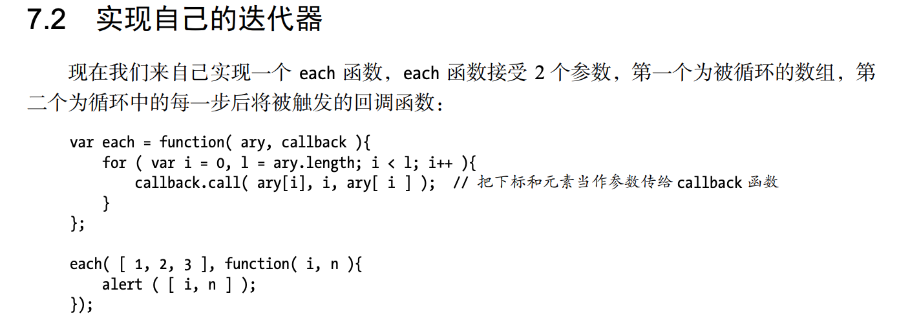
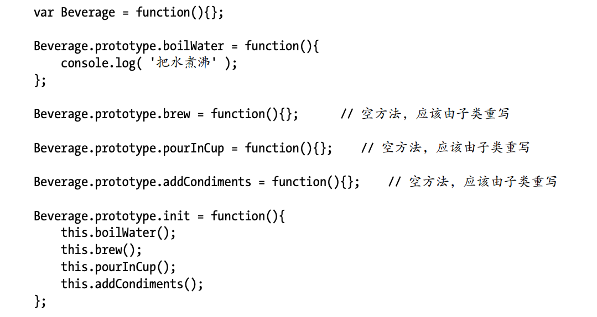

#### 代理模式
**定义**：代理模式的关键是，当客户不方便直接访问一个对象或者不满足需要的时候，提供一个替身对象来控制对这个对象的访问，客户实际上访问的是替身对象。替身对象对请求做出一些处理之后，再把请求转交给本体对象。代理一般有两种：`保护代理和虚拟代理`。代理可以帮实体过滤掉一些请求，这种称为保护代理。代理将一些开销比较大的操作，延迟到真正需要他的时候再去创建，这种成为虚拟代理。保护代理用于控制不同权限的对象对目标对象的访问，但在 JavaScript 并不容易实现保护代理，因为我们无法判断谁访问了某个对象。而虚拟代理是最常用的一种代理模式，所以我们重点讨论的的也是虚拟代理。

`举个例子：比如我要给一个图片在在加载过程中显示一张loading的图片占位符，这个时候就可以将图片预加载的这个动作交给代理去完成，创建一个图片节点的事情被隐藏在代理的后面，这样符合了单一职责的设计原则`

`还有一个例子：在 Web 开发中，也许最大的开销就是网络请求。
假设我们在做一个文件同步的功能，当我们选中一个 checkbox 的时候，它对应的文件就会被同步到另外一台备用服务器上面。如果在短时间内选中多个checkbox，那网略开销将会非常大，这个时候可以采用虚拟代理来合并请求。比如收集2秒内的请求，统一发送给服务器，这将大大减轻服务器的压力。`

`还有缓存代理，缓存代理可以为一些开销大的运算结果提供暂时的存储，在下次运算时，如果传递进来的参数跟之前一致，则可以直接返回前面存储的运算结果。`

代理包括许多小的分类，在JS开发中比较常用的是**虚拟代理**和**缓存代理**。

#### 迭代器模式
**定义**：迭代器模式是指提供一种方法顺序访问一个聚合对象中的各个元素，而又不需要暴露该对象的内部表示。现在主流的语言中几乎都已经有了内置的迭代器实现。forEach,iterator

迭代器也分`内部迭代器`和`外部迭代器`
**内部迭代器**：我们刚刚编写的 each 函数属于内部迭代器，each 函数的内部已经定义好了迭代规则，它完全接手整个迭代过程，外部只需要一次初始调用。
**外部迭代器**：外部迭代器必须显式地请求迭代下一个元素。iterator.要显示地调用next()

**JS中的应用**：比如我们现在要实现一个文件的上传功能。如果有浏览器控件的话采用浏览器空间上传，如果么有的话就用Flash上传，如果Flash也没有的话只能用原生的表单上传了。这个时候相比各种if-else分支语句，就可以使用迭代器来实现了。而且后期添加webkit控件上传和html5上传也很方便。

#### 发布-订阅模式
**定义**：发布订阅模式也成为观察者模式，它定义对象间的一种一对多的依赖关系，当一个对象的状态发生改变时，所有依赖于它的对象都将得到通知。在 JavaScript 开发中，我们一般用事件模型来替代传统的发布—订阅模式。DOM事件就是一个典型的发布订阅的模式。
`举个例子：买房，你和房地产商订阅了房源的消息，房地产商会在有房源的时候通知你，而不是你每天都要去询问。在业务中常见的例子就是登录，比如网站里面的header、nav、消息列表、购物车模块都需要登录信息。这个时候我们可以让登录模块在登录成功之后发布登录成功的消息，业务方接收这个消息，开始执行自己的业务`
JS中的实现：

#### 命令模式
**定义**：命令模式是最简单和优雅的模式之一，命令模式中的命令（command）指的是一个执行某些特定事情的指令。

举个例子：假设编写按钮样式和按钮逻辑的是不一样的人，要怎么做到低耦合呢？
对象属性实现：

闭包实现：

#### 组合模式
**定义**：组合模式就是用小的子对象来构建更大的对象，而这些小的子对象本身也许是由更小的“孙对象”构成的。

只需要在最上层的元素上执行execute方法。每当最上层的对象进行一次请求时，实际上是对整个树进行了遍历和执行。
**JS中的实现**：扫描文件夹

这个例子中删除其实是删除上层元素，但有时候需要子节点保留对父节点的引用，这种情况需要在子节点中保留一个对父节点的引用指针。实现请看书。

#### 模板方法模式
**定义**：

`举个例子：要冲一杯茶和一杯咖啡的步骤十分相似，可以把相同的步骤（方法）提取到父类中，并在父类中规定冲泡的顺序（方法的调用顺序）。在子类中再定义方法的具体实现。`

`钩子方法(hook)：模板方法在正常状态下是适用于大多数子类的，但是也有一些”个性“的子类，比如有些人要糖有些人不要，所以我们可以定义钩子函数来定制这些”个性“的需求。`

JS中的实现：上面的那种方法可以实现，当然JS中也不一定非要采用继承的方式。

#### 享元模式（flyweight轻量级选手）
**定义**：

`举个例子：我们有50件男性内衣，50件女性内衣需要塑料模特展示。我们不是创建100个塑料模特，而是创建一个男的一个女的，让他们分别换不同的内衣。这个就是把性别这个属性放到内部，内衣这个属性放到外部。`

`享元模式很多时候是为了解决对象爆炸的情况，对于文件的批量上传，其实我们只需要为不同的上传方式创建对象，让他们分别上传就可以了，没有必要为每个文件都创建一个上传对象。`
对象池：享元模式解决了独享爆炸的情况，有的时候对象池也可以缓解频繁创建对象的问题。思路就是创建一个对象池，如果对象池中已经有对象了就没有必要在重新创建，直接从对象池中获取就可以了。如果没有再重新创建。这对于频繁操作的DOM是很常用的。
比如要在地图上创建红色的小气泡。

#### 职责链模式
**定义**：

#### 中介者模式
**定义**：

举个例子：比如我在购买商品的时候有很多选项，型号啊，颜色啊，内存啊各种选择，最终才能放入购物车，同时框框的选中，加入购物车的按钮状态，库存对按钮状态的影响都是需要考虑的事情。如果是一般的实现，耦合度比较高。这个时候可以考虑采用中介者模式。

#### 装饰者模式

