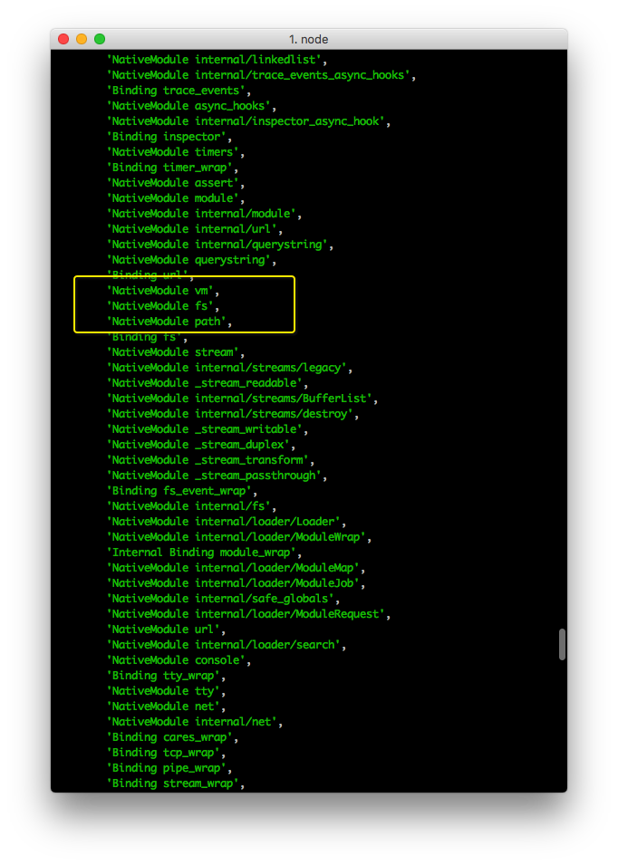
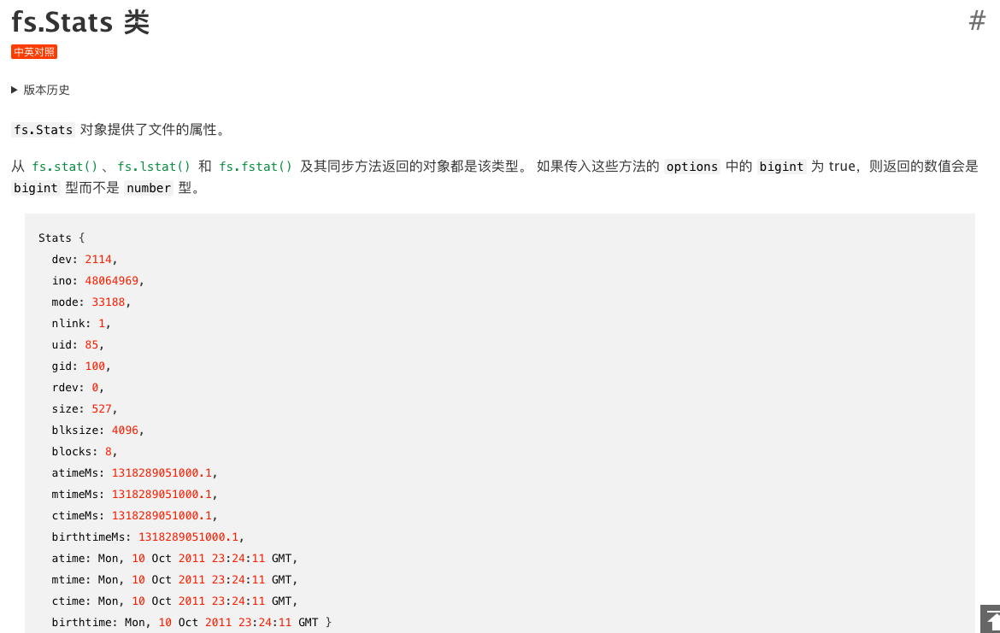
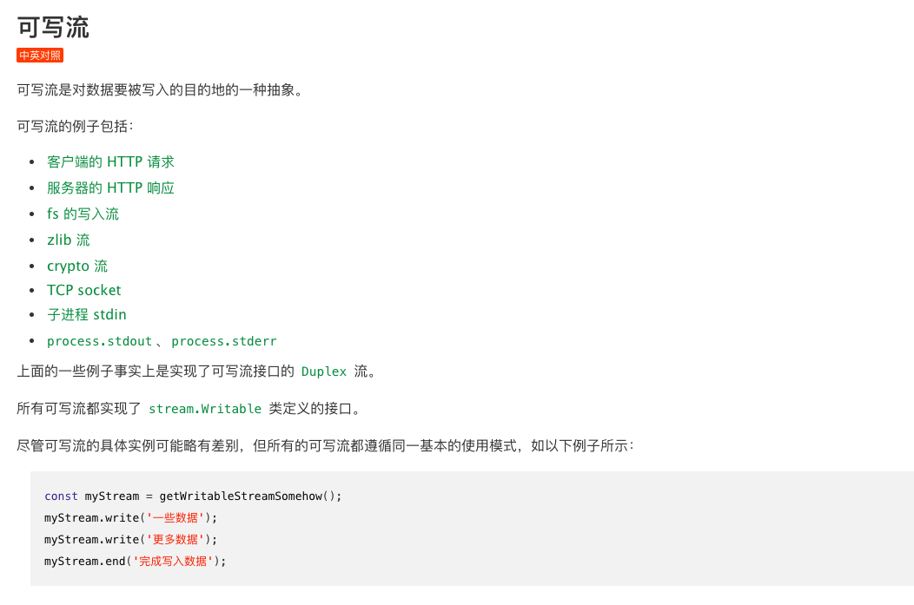
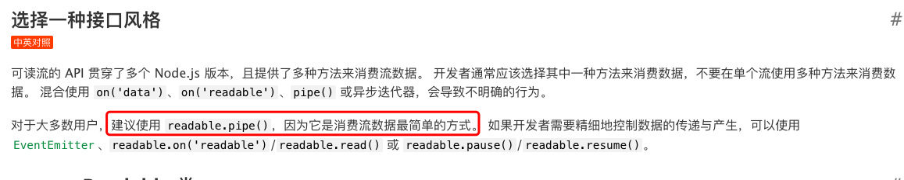

### 模块机制
---
1. 在node中使用require进行路径引入的时候。一般是采用相对路径进行引入的，如果只写了模块名的话，**node会依次在内置模块、全局模块和当前模块下查找**。（所谓模块，其实就是js文件。一个.js文件就是一个模块module）
2. 这种模块机制叫做CommonJS。在这个规范下，每个.js文件都是一个模块，他们内部各自使用的变量名和函数都互不冲突，比如`hello.js`和`mian.js`都申明了全局变量`var s = 'xxx'`,，但是互不影响。一个模块想要暴露给外部，可以使用 `module.exports = variable.`一个模块想要引入，就要用 `var ref = require('module_name')` ;
3. 其实要实现“模块”这个功能，并不需要语法层面的支持。Node.js也并不会增加任何JavaScript语法。实现“模块”功能的奥妙就在于JavaScript是一种函数式编程语言，它支持闭包。如果我们把一段JavaScript代码用一个函数包装起来，这段代码的所有“全局”变量就变成了函数内部的局部变量。
```js
//node加载完成之后，他把代码包装了一下。
//这样一来，原来的全局变量s现在变成了匿名函数内部的局部变量。
(function () {
    // 读取的hello.js代码:
    var s = 'Hello';
    var name = 'world';

    console.log(s + ' ' + name + '!');
    // hello.js代码结束
})();
```
4. `module.exports`其实实现起来也很容易。Node可以先准备一个对象module。变量module是Node在加载js文件前准备的一个变量，并将其传入加载函数，我们在hello.js中可以直接使用变量module原因就在于它实际上是函数的一个参数。通过把参数module传递给load()函数，hello.js就顺利地把一个变量传递给了Node执行环境，Node会把module变量保存到某个地方。
```js
// 准备module对象:
var module = {
    id: 'hello',
    exports: {}
};
var load = function (module) {
    // 读取的hello.js代码:
    function greet(name) {
        console.log('Hello, ' + name + '!');
    }

    module.exports = greet;
    // hello.js代码结束
    return module.exports;
};
var exported = load(module);
// 保存module:
save(module, exported);
```
由于Node保存了所有导入的module，当我们用require()获取module时，Node找到对应的module，把这个module的exports变量返回，这样，另一个模块就顺利拿到了模块的输出：

### 基本模块
---
1. 因为node是运行在服务器端的JavaScript环境，和浏览器程序相比，最大的特点就是没有浏览器的安全限制了。而且服务器程序是必须能接收网略请求的，读写文件，处理二进制内容，所以，Node内置的常用模块就是为了实现基本的服务器功能。而这些模块在浏览器环境中是无法被执行的，因为他们底层的代码使用C/C++在Node运行环境中实现的。

2. js有一个全局对象。在浏览器中叫window对象，而在Node环境中，是`global`。两者的属性和方法是不用的。可以直接在控制台打印一下global对象。几个常见的属性有console、**process（代表当前node进程）**、Buffer、clearTimeout\Interval、setTimeout\Interval、module、require
3. JavaScript程序是**由事件驱动执行的单线程模型**，Node.js也不例外。Node.js不断执行响应事件的JavaScript函数，直到没有任何响应事件的函数可以执行时，Node.js就退出了。
4. `process` .Node进程本身的事件就是有process对象来处理的。控制台打印process。可以看到很多moduleLoadList、config.variable、versions、env、pid、nextTick（等到下一次事件循环的时候调用）、stdout、stdin、exit（程序即将退出时执行某个回调函数）、kill等等常见的方法和属性。
5. js的内置基本模块。
 
 
 #### fs
 ---
 
 NodeJS内置的fs模块是文件系统模块，负责读写文件。fs模块同时提供了异步和同步方法。
 
 ##### 读文件
 ```js
'use strict';
//依次在内置模块、全局模块和当前模块下查找
var fs = require('fs');

fs.readFile('sample.txt', 'utf-8', function (err, data) {
    if (err) {
        console.log(err);
    } else {
        console.log(data);
    }
});
```
异步读取时，传入的回调函数接收两个参数，当正常读取时，err参数为null，data参数为读取到的String。当读取发生错误时，err参数代表一个错误对象，data为undefined。这也是Node.js标准的回调函数：第一个参数代表错误信息，第二个参数代表结果。后面我们还会经常编写这种回调函数。

由于err是否为null就是判断是否出错的标志，所以通常的判断逻辑总是：
```js
if (err) {
    // 出错了
} else {
    // 正常
}
```
读取二进制文件，如图片：
```js
'use strict';

var fs = require('fs');

fs.readFile('sample.png', function (err, data) {
    if (err) {
        console.log(err);
    } else {
        console.log(data);
        console.log(data.length + ' bytes');
    }
});
```
当读取二进制文件时，不传入文件编码时，回调函数的data参数将返回一个Buffer对象。在Node.js中，Buffer对象就是一个包含零个或任意个字节的数组（注意和Array不同）。
```js

'use strict';

var fs = require('fs');

fs.readFile('sample.png', function (err, data) {
    if (err) {
        console.log(err);
    } else {
        console.log(data);
        console.log(data.length + ' bytes');
    }
});
```
```js
//Buffer对象可以和String作转换，例如，把一个Buffer对象转换成String：
// Buffer -> String
var text = data.toString('utf-8');
console.log(text);

//或者把一个String转换成Buffer：

// String -> Buffer
var buf = Buffer.from(text, 'utf-8');
console.log(buf);
```

同步读取文件的方法是fs.readFileSync('sample.txt,'utf-8'')。将读取到的data直接返回。如果在读取文件汇总发生错误，需要用try-catch捕获错误。
```js
try {
    var data = fs.readFileSync('sample.txt', 'utf-8');
    console.log(data);
} catch (err) {
    // 出错了
}
```
 ##### 写文件
 ```js
'use strict';

var fs = require('fs');

var data = 'Hello, Node.js';
fs.writeFile('output.txt', data, function (err) {
    if (err) {
        console.log(err);
    } else {
        console.log('ok.');
    }
});
```
##### fs.Stats类
我们可以通过这个类获取文件大小、创建时间等信息。


从fs.stat()、fs.lstat() 和 fs.fstat() 以及他们的同步方法返回的对象都是该类型。


#### 流 stream
---

http://nodejs.cn/api/stream.html#stream_stream

所有可以读取数据的流都继承自stream.Readable，所有可以写入的流都继承自stream.Writable

Node.js 创建的流都是运作在字符串和 Buffer（或 Uint8Array）上。




#### http模块
要开发HTTP服务器程序，从头处理TCP连接，解析HTTP是不现实的。这些工作实际上已经由Node.js自带的http模块完成了。应用程序并不直接和HTTP协议打交道，而是操作http模块提供的request和response对象。
http.server类继承自net.Server。net.Server用处创建TCP或IPC server


