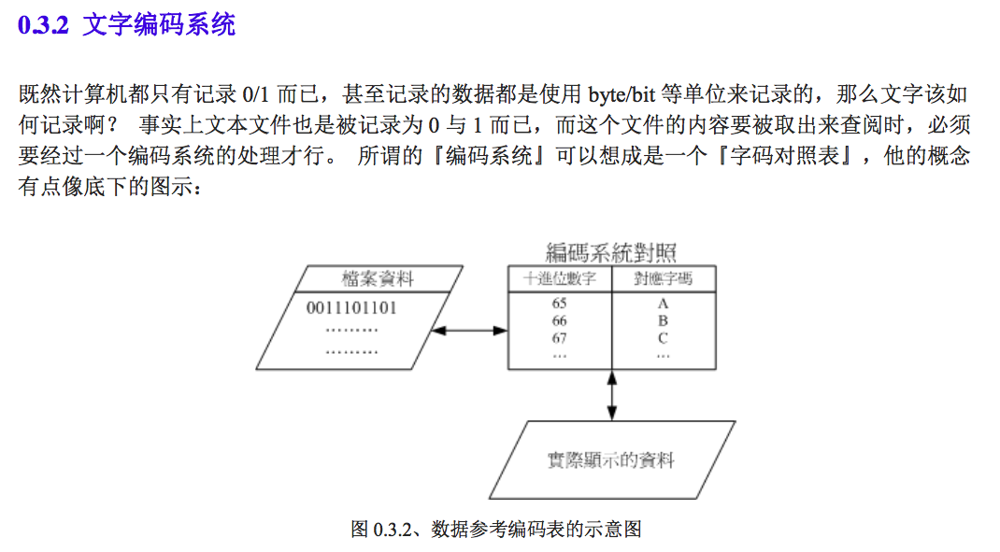
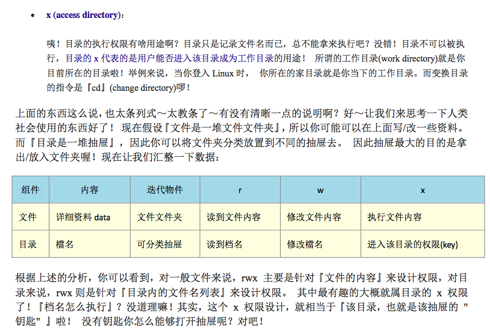
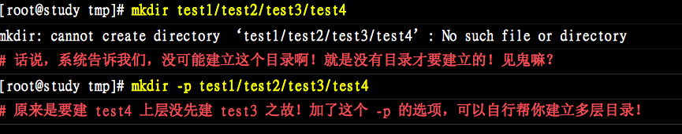
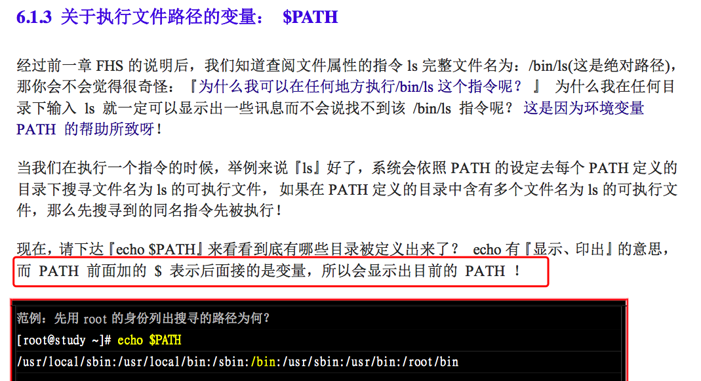
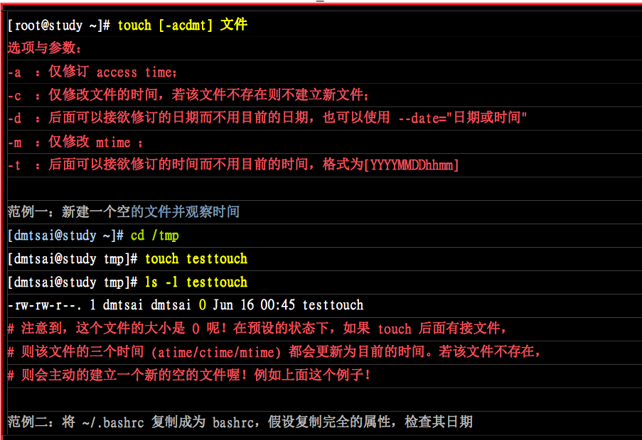
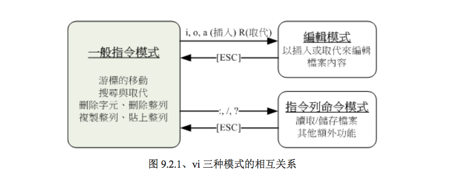
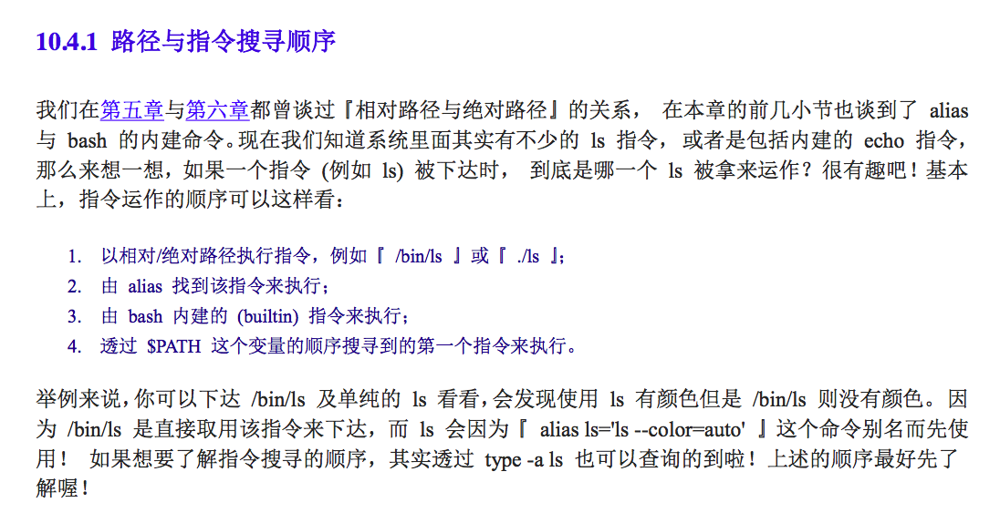
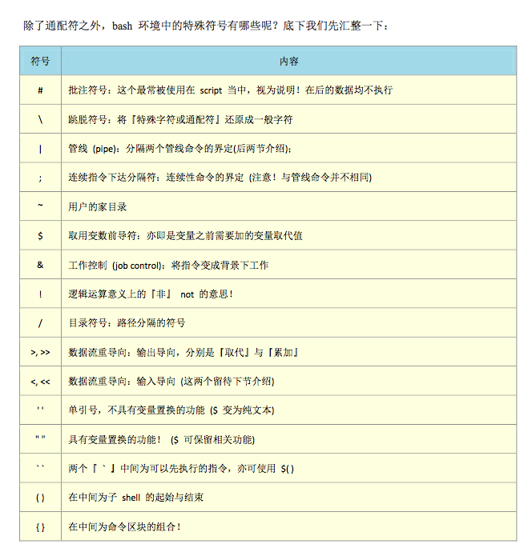
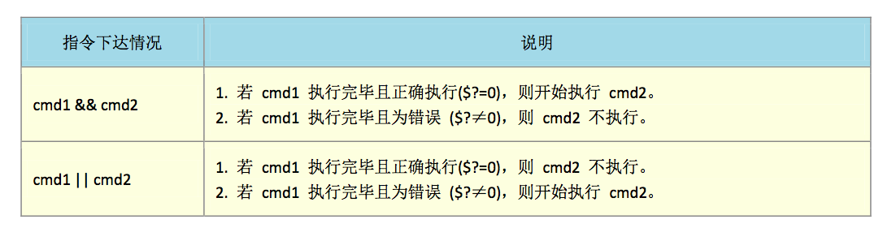

#### 计算机基础知识
---

#### **操作系统相当于 我们编写的程序和底层硬件之间的媒介。**

#### Linux文件目录
mac 上的文件目录

一些我们自己安装的指令比如git、npm、node都是在/usr/local/bin目录下，查看命令安装在那个目录下，可以通过which来查看

---

**1,5,8是比较重要的类别**

`ls -al`
显示的是：（.开头的是隐藏文件）

cd:change directory
pwd:print working directory
mkdir:make directory
rmdir:remove directory 。只能删除空的文件夹

#### Linux常用指令
`cat` （concatenate连接的，连锁的）从第一行开始显示文件内容

如果文件不存在会自动创建一个文件文件

被拿掉的权限

#### vim

#### bash/shell

